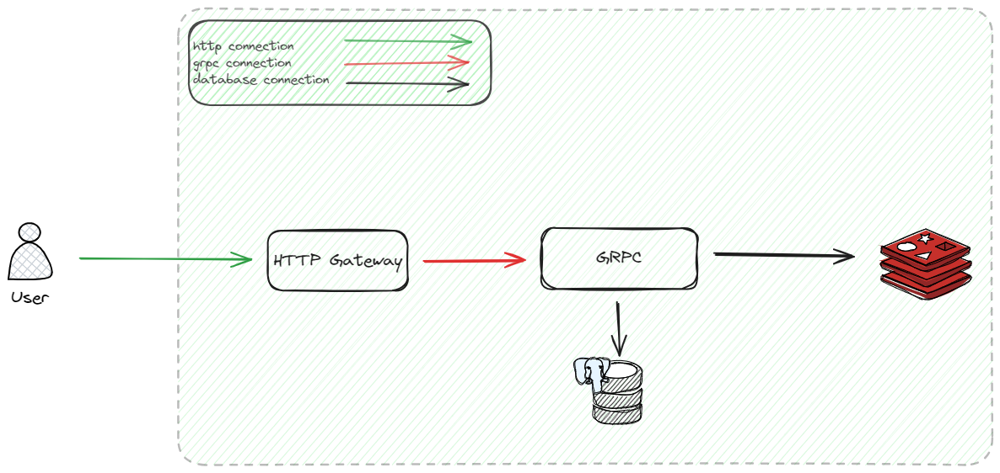

# MiniBank

MiniBank is a simple banking system that allows users to create an account, deposit, withdraw, and transfer money between accounts.

## Architecture diagram


## Quick start

Clone this repository:
```sh
git clone https://github.com/vantu-fit/MiniBank.git
cd MiniBank
```
#### Docker usage

Run this command:
```sh
docker compose up
```

#### Simple usage
First, we need to signup a new user:
```bash
curl --location 'http://localhost/v1/create_user' \
--header 'Content-Type: application/json' \
--data-raw '{
    "username" : "dotu12",
    "password" : "123456",
    "full_name" : "dovantu" ,
    "email" : "dotu3@gmail.com"
}'
```
response:
```json
{
    "user": {
        "username" : "dotu12",
        "password" : "123456",
        "email": "dotu3@gmail.com",
        "password_changed_at": "0001-01-01T00:00:00Z",
        "created_at": "2024-05-01T12:50:57.427527Z"
    }
}
```
This will return a new token pair (refresh token + access token). We should provide the access token in the `Authorization` header for those APIs with authentication. If your access token is expired. You can login again or get new access token via refresh token.
```bash
curl --location 'http://localhost/v1/login_user' \
--header 'Content-Type: application/json' \
--data-raw '{
    "username" : "dotu12",
    "password" : "123456"
}'
```

response:
```json
{
    "access_token": "v2.local.bnSipaT9c_F4IMjSUmn0PQpAC33_Z3REXsMvp8KvSrEn2Y2zlqCXyqIl0LA5Mt48BCXu0BELHMIeGkY7dV03_29fD7S-ZUWSbIys8dikI4IbbE-BglKJMSzek99WeZ_Qqi5gbXOf5IH3kUqgpP03BC3KeUTc9ozx_TV2HQ9QPGsaBVpK3ltRxATriGUU4Wd5I3WoyUlI00l7Gt7e1fClXqgTre8uLN2NfCVopt-x5kOYjZsgqD_u50Cx7-t_E1edpTqP_6JYwsAVZ1QshXHM2x5jwLN47A.bnVsbA",
    "access_token_expried_at": "2024-05-01T13:13:26.000816177Z",
    "refresh_token": "v2.local.tXQjn3YwS2W-JuD4BES445C_hf4Ou-ZcvSCU8Z6Zgaw6Q5hXgQDxStA88N1GqwWj4ndpogB2kyDNg1Hl-Ro7jBzvDwG7Xyxinj16arvz63sztfRn_a5ezdeKWVC6QhlVtJ8iFYh1khAO73KaxaWazKb5TQISroqr0WGLk7kaWFFzTao_u0bA8z5dV3FdjnTohG5UZob_34tDU-vts7b_dpahlQfnFl3HksDB7uFRE4EHnhVk3jxLaqpeo_5xazLZWPDtn8u5z4SqppWoURkjmO617XJE9g.bnVsbA",
    "refresh_token_expried_at": "2024-05-01T13:13:26.000928130Z",
    "session_id": "a1bdf399-3339-45dd-a074-50059947d1c6",
    "user": {
        "username": "dotu12",
        "full_name": "gggg",
        "email": "dotu30257@gmail.com",
        "password_changed_at": "0001-01-01T00:00:00Z",
        "created_at": "0001-01-01T00:00:00Z"
    }
}
```

Next, let's update information of the user we just created:
```bash
curl --location 'http://localhost/v1/update_user' \
--header 'Content-Type: application/json' \
--header 'Authorization: Bearer <access_token>' \
--data '{
    "username" : "dotu12",
    "password" : "123456",
    "full_name" : "dovtudo11144441"
}' -X PATCH
```
response:
```json
{
    "user": {
        "username": "dotu12",
        "full_name": "dovtudo11144441",
        "email": "dotu3@gmail.com",
        "password_changed_at": "2024-05-01T13:10:59.944127Z",
        "created_at": "2024-05-01T13:04:47.609595Z"
    }
}
```
And some other APIs ...


## Monitor

### Docs API
[http://localhost/swagger/](http://localhost/swagger/)
